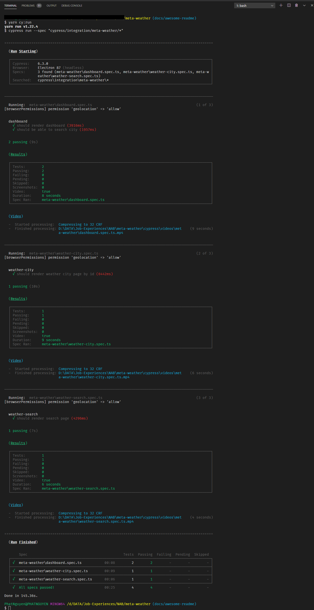

# [Meta Weather](https://meta-weather-seven.vercel.app/)


[](https://codecov.io/gh/phatnguyenuit/meta-weather)


This project was bootstrapped with [Create React App](https://github.com/facebook/create-react-app).

.png)

## Table of Contents

- [Meta Weather](#meta-weather)
  - [Table of Contents](#table-of-contents)
  - [Introduction](#introduction)
  - [Preview](#preview)
  - [Features](#features)
  - [Flow diagram](#flow-diagram)
    - [Getting current weather based on user location](#getting-current-weather-based-on-user-location)
  - [Prerequisites](#prerequisites)
  - [Installation](#installation)
  - [Code coverage](#code-coverage)
  - [End to end testing with Cypress](#end-to-end-testing-with-cypress)
    - [Prepare environment](#prepare-environment)
    - [GUI mode](#gui-mode)
      - [Main UI to interact](#main-ui-to-interact)
      - [Chrome browser test runner](#chrome-browser-test-runner)
    - [Headless mode](#headless-mode)
  - [Technologies](#technologies)
  - [Responsive UI](#responsive-ui)
    - [Dashboard](#dashboard)
      - [On large screen](#on-large-screen)
      - [On small screen](#on-small-screen)
      - [On mobile screen](#on-mobile-screen)
    - [Search city page](#search-city-page)
      - [On large screen](#on-large-screen-1)
      - [On small screen](#on-small-screen-1)
      - [On mobile screen](#on-mobile-screen-1)
    - [City weather page](#city-weather-page)
      - [On large screen](#on-large-screen-2)
      - [On small screen](#on-small-screen-2)
      - [On mobile screen](#on-mobile-screen-2)
  - [Learn More](#learn-more)
  - [Changelog](#changelog)
  - [License](#license)

[Go to top ⏫](#meta-weather)

## Introduction

This project inspired on building a weather forecast website. Using [Meta Weather Public API](http://metaweather.com/api/) to get weather forecast data.

**Warning*: Cause of CORS issue on [Meta Weather Public API](http://metaweather.com/api/), so I decided to build a [simple proxy server](https://github.com/phatnguyenuit/meta-weather-proxy) to serve API data for my webapp.*

[Go to top ⏫](#meta-weather)

## Preview

Deployed ✅ on [Vercel](https://vercel.com/): ➡ [Click here to access!](https://meta-weather-seven.vercel.app)

## Features

- Get current weather forecast.
- Detect current location by: `Geolocation API`, `IP`.
- Search city by keyword.
- Show weather forecast in the next 5 days.
- Monitor and manage error by `Sentry`
- Automate workflow with `GitHub Actions`
- Automate release versioning with `release-it`
- Redux modular files structure
- Custom hooks

[Go to top ⏫](#meta-weather)

## Flow diagram

### Getting current weather based on user location


[Go to top ⏫](#meta-weather)

## Prerequisites

- [NodeJS](https://nodejs.org/en/) from version `10` installed
- [Yarn](https://yarnpkg.com/) Package manager installed
- IDE (ex: [Visual Studio Code](https://code.visualstudio.com/))
- [Clone my meta-weather API proxy](https://github.com/phatnguyenuit/meta-weather-proxy) / create your own.
- [Register and get your IP-Geolocation API access key](https://ip-geolocation.whoisxmlapi.com)
- [Register and get Sentry DSN for your React project](https://sentry.io/)

[Go to top ⏫](#meta-weather)

## Installation

- Step 1: Open terminal on change directory to your clone folder
  
  ```sh
  $ cd path/to/some/where/you/clone
  ```

- Step 2: Install `node_modules`
  
  ```sh
  $ yarn install
  ```

- Step 3: Prepare your own environment variables
  
  ```sh
  $ cp .env.sample .env.local
  ```

  ```sh
  # ACCESS_KEY from https://ip-geolocation.whoisxmlapi.com
  REACT_APP_GEO_ACCESS_KEY=<YOUR KEY>

  # META WEATHER PROXY URL
  REACT_APP_META_WEATHER_PROXY_URL=<YOUR PROXY URL>

  # SENTRY DSN
  REACT_APP_SENTRY_DSN=<SENTRY DSN FOR YOUR PROJECT>

  PORT=<PORT TO SERVE WEB APP>

  ```

- Step 4: Start `meta-weather proxy server` (mentioned in [Prerequisites](#prerequisites))

- Step 5: Start react app
  
  ```sh
  $ yarn start
  ```

- Step 6: Drink coffee ☕ and enjoy 😁

[Go to top ⏫](#meta-weather)

## Code coverage

Usage

```sh
$ yarn test --coverage --watchAll
```

**Current code coverage is `97%`**


[Go to top ⏫](#meta-weather)

## End to end testing with Cypress

### Prepare environment

- Create your own `cypress.env.json` from `cypress.env.json.example`

```sh
$ cp cypress.env.json.example cypress.env.json
```

```json
{
  "host": "
    web host to test (can be your deployed url)
    localhost can only use in cypress open not cypress run.
    Use IP address of your local instead 
    Example: 
     - http://xxx.yyy.zz.tt:port
     - https://www.your-website.com
  "
}
```

- In case you want to test browser permissions, you can refer to this package [cypress-browser-permissions](https://github.com/kamranayub/cypress-browser-permissions) to know how to override and set fixed permissions for each test case.

### GUI mode

```sh
$ yarn cy:open
```

#### Main UI to interact


#### Chrome browser test runner


### Headless mode

```sh
$ yarn cy:open
```



[Go to top ⏫](#meta-weather)

## Technologies

- [ReactJS](https://reactjs.org/docs/getting-started.html) - Main library for building UI with components approach
- [React Hooks](https://reactjs.org/docs/hooks-intro.html) - Custom hooks to reuse logic
- [TypeScript](https://www.typescriptlang.org/) - Typed JavaScript at Any Scale.
- [Redux](https://redux.js.org/) - State Management
- [Redux Saga](https://redux-saga.js.org/) - redux middleware providing application side effects like asynchronous data fetching
- [Material UI](https://material-ui.com/) - React Components based on Material Design, higher customization
- [React router](https://reactrouter.com/) - Supports router in ReactJS single page application
- [Geolocation API](https://developer.mozilla.org/en-US/docs/Web/API/Geolocation_API) - WebAPI supports Geolocation
- [Jest](https://jestjs.io/) - delightful JavaScript Testing Framework with a focus on simplicity.
- [React Testing Library](https://testing-library.com/docs/react-testing-library/intro/) - a very light-weight solution for testing React components
- [Cypress](https://www.cypress.io/) - JavaScript End to end testing framework
- [Sentry](https://sentry.io/) - Application Monitoring and Error Tracking Software
- [GitHub Actions](https://github.com/features/actions) - Automate workflow in GitHub
- [ESlint](https://eslint.org/) - JavaScript linter plugin
- [Husky](https://github.com/typicode/husky) - Git hooks
- [Lint staged](https://www.npmjs.com/package/lint-staged) - Lint staged git files and don't let 💩 slip into your code base
- [Commitlint](https://commitlint.js.org/#/) - Lint commit messages
- [Prettier](https://prettier.io/) - Code auto formatter
- [Release-it](https://github.com/release-it/release-it) - Automate versioning and package publishing
- [GitHub Pages](https://pages.github.com/) - Free GitHub place to serve static websites
- [Codecov](https://about.codecov.io/) - Code coverage integration
- [Vercel](https://vercel.com/) - the best place to deploy any frontend app

[Go to top ⏫](#meta-weather)

## Responsive UI

[Go to top ⏫](#meta-weather)

### Dashboard

#### On large screen

.png)

[Go to top ⏫](#meta-weather)

#### On small screen

.png)

[Go to top ⏫](#meta-weather)

#### On mobile screen

.png)

[Go to top ⏫](#meta-weather)

### Search city page

#### On large screen

.png)

[Go to top ⏫](#meta-weather)

#### On small screen

.png)

[Go to top ⏫](#meta-weather)

#### On mobile screen

.png)

[Go to top ⏫](#meta-weather)

### City weather page

#### On large screen

.png)

[Go to top ⏫](#meta-weather)

#### On small screen

.png)

[Go to top ⏫](#meta-weather)

#### On mobile screen

.png)

[Go to top ⏫](#meta-weather)

## Learn More

- You can learn more in the [Create React App documentation](https://facebook.github.io/create-react-app/docs/getting-started).

- Learn React, check out the [React documentation](https://reactjs.org/).

- Learn [Redux](https://redux.js.org/introduction/getting-started)

- Learn [Cypress End to end testing](https://docs.cypress.io/guides/getting-started/installing-cypress.html#System-requirements)

- Getting started with [Material UI](https://material-ui.com/getting-started/installation/)

- Getting started with [Sentry][(https://material-ui.com/getting-started/installation/](https://sentry.io/))

- Learn [GitHub Actions](https://docs.github.com/en/free-pro-team@latest/actions/learn-github-actions)

- Learn [ESLint](https://eslint.org/docs/user-guide/getting-started)

- Learn [Commitlint](https://commitlint.js.org/#/)

- Learn [Release-it](https://github.com/release-it/release-it)

[Go to top ⏫](#meta-weather)

## Changelog

See [CHANGELOG.md](./CHANGELOG.md)

## License

[MIT](./LICENSE) © Phát Nguyễn (Fast)
