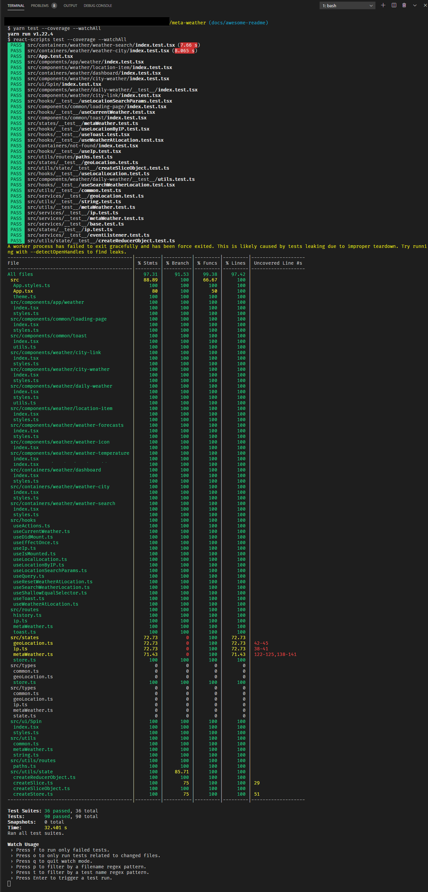

# [Meta Weather](https://meta-weather-seven.vercel.app/)


[](https://codecov.io/gh/phatnguyenuit/meta-weather)


This project was bootstrapped with [Create React App](https://github.com/facebook/create-react-app).

.png)

## Table of Contents

- [Meta Weather](#meta-weather)
  - [Table of Contents](#table-of-contents)
  - [Introduction](#introduction)
  - [Features](#features)
  - [Flow diagram](#flow-diagram)
    - [Getting current weather based on user location](#getting-current-weather-based-on-user-location)
  - [Technologies](#technologies)
  - [Prerequisites](#prerequisites)
  - [Installation](#installation)
  - [Code coverage](#code-coverage)
  - [Responsive](#responsive)
    - [Dashboard](#dashboard)
      - [On large screen](#on-large-screen)
      - [On small screen](#on-small-screen)
      - [On mobile screen](#on-mobile-screen)
    - [Search city page](#search-city-page)
      - [On large screen](#on-large-screen-1)
      - [On small screen](#on-small-screen-1)
      - [On mobile screen](#on-mobile-screen-1)
    - [City weather page](#city-weather-page)
      - [On large screen](#on-large-screen-2)
      - [On small screen](#on-small-screen-2)
      - [On mobile screen](#on-mobile-screen-2)
  - [Learn More](#learn-more)

[Go to top ⏫](#meta-weather)

## Introduction

This project inspired on building a weather forecast website. It's simple website includes some main features below

[Go to top ⏫](#meta-weather)

## Features

- Detect current location by: Geolocation API, IP.
- Search city by keyword.
- Show weather forecast in the next 5 days.

[Go to top ⏫](#meta-weather)

## Flow diagram

### Getting current weather based on user location


[Go to top ⏫](#meta-weather)

## Technologies

- ReactJS (Hooks)
- TypeScript
- Redux
- Redux Saga
- Material UI
- React router
- Geolocation API
- Test framework: Jest
- Unit test library: React Testing Library
- End to end testing library: Cypress
- Sentry monitor
- GitHub Actions
- ESlint
- Husky
- Lint staged
- Commitlint
- Prettier
- Release-it
- GitHub Pages
- Vercel static website provider

[Go to top ⏫](#meta-weather)

## Prerequisites

- NodeJS from version `10` installed
- Yarn
- IDE (ex: Visual Studio Code)
- [Clone my meta-weather API proxy](https://github.com/phatnguyenuit/meta-weather-proxy) / create your own.
- [Register and get your IP-Geolocation API access key](https://ip-geolocation.whoisxmlapi.com)
- [Register and get Sentry DSN for your React project](https://sentry.io/)

[Go to top ⏫](#meta-weather)

## Installation

- Step 1: Open terminal on change directory to your cloned folder
  
  ```sh
  $ cd /some/where/you/cloned
  ```

- Step 2: Install `node_modules`
  
  ```sh
  $ yarn install
  ```

- Step 3: Prepare your own environment variables
  
  ```sh
  $ cp .env.sample .env.local
  ```

  ```sh
  # ACCESS_KEY from https://ip-geolocation.whoisxmlapi.com
  REACT_APP_GEO_ACCESS_KEY=<YOUR KEY>

  # META WEATHER PROXY URL
  REACT_APP_META_WEATHER_PROXY_URL=<YOUR PROXY URL>

  # SENTRY DSN
  REACT_APP_SENTRY_DSN=<SENTRY DSN FOR YOUR PROJECT>

  PORT=<PORT TO SERVE WEB APP>

  ```

- Step 4: Start `meta-weather proxy server` (mentioned in [Prerequisites](#prerequisites))

- Step 5: Start react app
  
  ```sh
  $ yarn start
  ```

- Step 6: Drink coffee ☕ and enjoy 😁

[Go to top ⏫](#meta-weather)

## Code coverage

Usage

```sh
$ yarn test --coverage --watchAll
```

**Current code coverage is `97%`**



[Go to top ⏫](#meta-weather)

## Responsive

[Go to top ⏫](#meta-weather)

### Dashboard

#### On large screen

.png)

[Go to top ⏫](#meta-weather)

#### On small screen

.png)

[Go to top ⏫](#meta-weather)

#### On mobile screen

.png)

[Go to top ⏫](#meta-weather)

### Search city page

#### On large screen

.png)

[Go to top ⏫](#meta-weather)

#### On small screen

.png)

[Go to top ⏫](#meta-weather)

#### On mobile screen

.png)

[Go to top ⏫](#meta-weather)

### City weather page

#### On large screen

.png)

[Go to top ⏫](#meta-weather)

#### On small screen

.png)

[Go to top ⏫](#meta-weather)

#### On mobile screen

.png)

[Go to top ⏫](#meta-weather)

## Learn More

- You can learn more in the [Create React App documentation](https://facebook.github.io/create-react-app/docs/getting-started).

- Learn React, check out the [React documentation](https://reactjs.org/).

- Learn [Redux](https://redux.js.org/introduction/getting-started)

- Learn [Cypress End to end testing](https://docs.cypress.io/guides/getting-started/installing-cypress.html#System-requirements)

- Getting started with [Material UI](https://material-ui.com/getting-started/installation/)

- Getting started with [Sentry monitor][(https://material-ui.com/getting-started/installation/](https://sentry.io/))

- Learn [GitHub Actions](https://docs.github.com/en/free-pro-team@latest/actions/learn-github-actions)

- Learn [ESLint](https://eslint.org/docs/user-guide/getting-started)

- Learn [Commitlint](https://commitlint.js.org/#/)

- Learn [Release-it](https://github.com/release-it/release-it)

[Go to top ⏫](#meta-weather)
